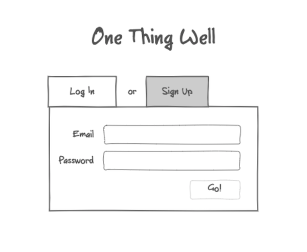
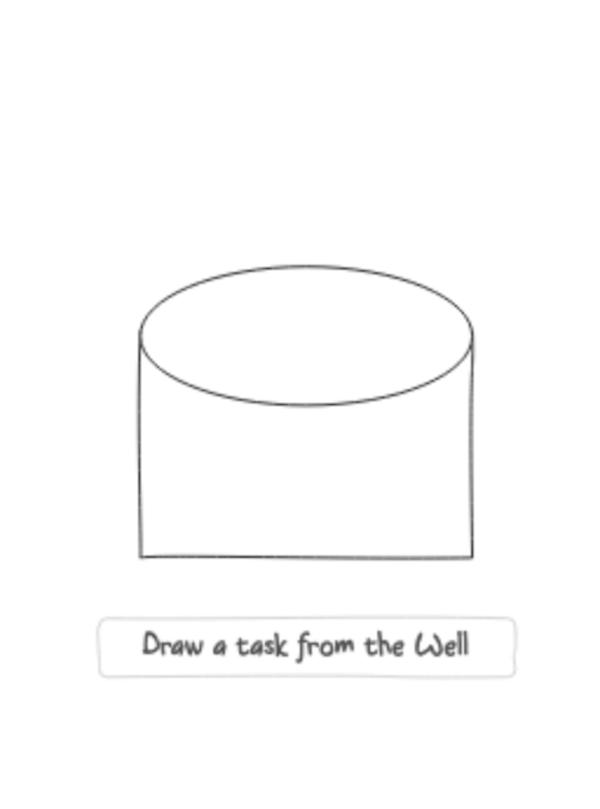

# One Thing Well

One Thing Well is a todo application that helps you focus on the one thing that you need to (or want to) work on right now. It's easy to look at a long list of items to do and get stuck trying to decide which one is most important or urgent and wind up either fiddling with the list, or get overwhelmed and wind up doing nothing at all. Here, you'll add all of your todos (no matter how big or small) to one "bucket", and OTW will choose one for you at random to focus on. As you use the app, it will try to learn what's more important or urgent for you, and help you get those done, while still throwing you some surprises every now and then.

This is the repo for the front end, and you can visit the hosted app [here](http://some.hosting.service/myapp). The back end repo is [here](http://github.com/itsame/myapp-backend), which documents the API and database schema.

## User Stories

* As a guest, I want to be able to create an account, so I can log in and use the app.
* As a user, I want to be able to log into the app with a username and password, so I can use the app.
* As a user, I would like to be able to set my name and photo in my profile, to personalize the app.
* As a user, I want to be able to enter my most important long-term goal as a default action item, so I always have something to do after I run out of other tasks.
* As a user, I want to be able to select a random task from the well, so I can focus on one thing at a time.
* As a user, I want to be able to add a new task to the well, to create a list of tasks to draw from.
* As a user, I want to be able to mark a task as complete, so I can move on to the next task.
* As a user, I would like to be able to see all of my completed tasks, so I can see what I've accomplished.
* As a user, I want to see my current task in a prominent position, so I can easily see what I'm working on.
* As a user, I want to be able to delay my current task by drawing another task, so the app will learn which tasks are less urgent.
* As a user, I want to be able to "sink" or reject my current task, so the app will learn which tasks are less important.
* As a user, I want a new task to automatically appear when I complete, delay, or sink a task, so I always have something to work on.
* As a user, I would like my login to persist across sessions, so I don't have to log in every time.
* As a user, I would like to log out of the app, so another user can use it.

## Wireframes / Mockup

## Contact info 

I'm [Marc Majcher](https://github.com/marcmajcher), and I'm currently a lead software engineering instructor at [Flatiron School](https://flatironschool.com/). Drop me a line if you'd like to chat about a project!
